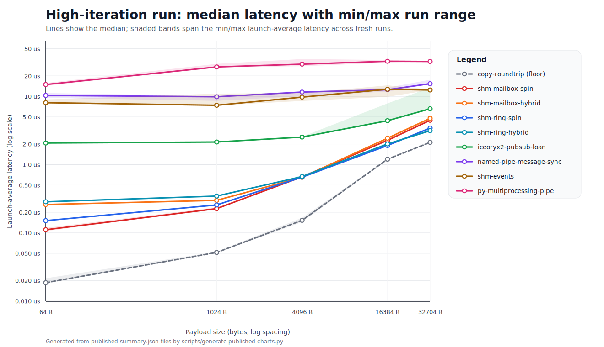
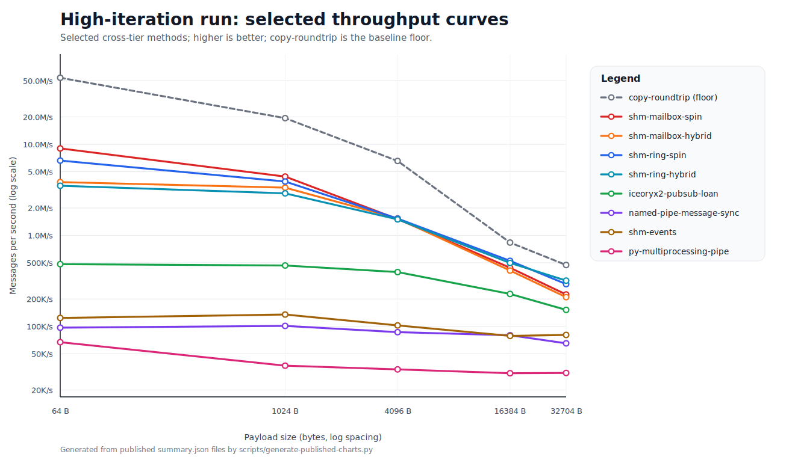

# ipc-bench

Windows 11 IPC benchmark suite inspired by [`goldsborough/ipc-bench`](https://github.com/goldsborough/ipc-bench), rebuilt around a Rust workspace and Windows-native IPC primitives.

## Scope

This suite measures **same-machine, low-level, programmable IPC** on Windows 11. It intentionally excludes GUI- and app-integration-oriented mechanisms such as Clipboard, DDE, OLE/COM automation, and `WM_COPYDATA`.

Each benchmark follows the same basic contract:

- parent/child process topology
- ping-pong round trips
- configurable message count, message size, warmups, and trials
- comparable JSON output across Rust and Python methods

## Published result sets

The repository includes two published result sets under `results\published`.

| Result set | Purpose | Methodology | Full results |
| --- | --- | --- | --- |
| **Initial published run** | Baseline full-matrix run across all implemented methods | **Release** Rust profile; `1000` messages, `100` warmups, `3` trials; message sizes `64`, `1024`, `4096`, `16384`, `32704`; fixed parent/child CPU affinity; `5` fresh launches summarized by median launch-average latency plus p10/p90 spread | [Directory](results/published/windows11-initial), [metadata.json](results/published/windows11-initial/metadata.json), [run-status.json](results/published/windows11-initial/run-status.json), [summary.csv](results/published/windows11-initial/summary.csv), [summary.json](results/published/windows11-initial/summary.json) |
| **High-iteration run** | Lower-noise rerun for very low-latency methods | **Release** Rust profile; `100000` messages, `10000` warmups, `7` trials by default across the same message sizes; `mailslot` override of `5000` / `200` / `5`; fixed parent/child CPU affinity; `5` fresh launches summarized by median launch-average latency plus p10/p90 spread | [Directory](results/published/windows11-high-iterations), [metadata.json](results/published/windows11-high-iterations/metadata.json), [run-status.json](results/published/windows11-high-iterations/run-status.json), [summary.csv](results/published/windows11-high-iterations/summary.csv), [summary.json](results/published/windows11-high-iterations/summary.json) |

Both published sets currently contain **130 completed runs** and **0 failures**.

Both published sets were generated on:

- **OS:** Microsoft Windows 11 Pro, build 26200
- **CPU:** AMD Ryzen 9 7950X3D (16 cores / 32 logical processors)
- **Rust:** `rustc 1.94.0`, `cargo 1.94.0`
- **Python:** 3.14.3

Use `summary.json` or `summary.csv` for quick comparison, and the per-method JSON files when you need full per-trial and per-launch detail.

`summary.average_micros` is the published headline metric: the median launch-average latency across fresh benchmark launches. `p10_average_micros`, `p90_average_micros`, and `launch_stddev_average_micros` describe run-to-run spread. This README keeps the compact current-state view; [RESULTS.md](RESULTS.md) contains the full baseline table, both published chart sets, and the longer narrative analysis.

## Published charts

This top-level view keeps only the stable high-iteration spread and throughput charts so the README stays compact. The range chart shows the median line plus the min/max launch-average band across fresh runs. [RESULTS.md](RESULTS.md) includes the full chart set for both published snapshots.





## High-iteration results

Each cell shows median launch-average round-trip latency in microseconds on the first line and messages/sec on the second line from `results\published\windows11-high-iterations\summary.json`. Lower latency and higher throughput are better. The `Highlight` column marks the fastest practical IPC row for each payload size in this table; `copy-roundtrip` remains the copy-only floor.

| Highlight | Tier | Method | 64 B | 1024 B | 4096 B | 16384 B | 32704 B |
| --- | --- | --- | ---: | ---: | ---: | ---: | ---: |
| **Baseline floor** | Native baseline | `copy-roundtrip` | 0.019 us<br>53.9M/s | 0.052 us<br>19.4M/s | 0.152 us<br>6.6M/s | 1.200 us<br>833.2K/s | 2.117 us<br>472.4K/s |
| — | Core native | `anon-pipe` | 13.804 us<br>72.4K/s | 16.719 us<br>59.8K/s | 18.626 us<br>53.7K/s | 19.187 us<br>52.1K/s | 22.455 us<br>44.5K/s |
| — | Core native | `named-pipe-byte-sync` | 10.318 us<br>96.9K/s | 9.324 us<br>107.3K/s | 10.235 us<br>97.7K/s | 11.325 us<br>88.3K/s | 15.488 us<br>64.6K/s |
| — | Core native | `named-pipe-message-sync` | 10.333 us<br>96.8K/s | 9.878 us<br>101.2K/s | 11.573 us<br>86.4K/s | 12.516 us<br>79.9K/s | 15.359 us<br>65.1K/s |
| — | Core native | `named-pipe-overlapped` | 10.161 us<br>98.4K/s | 9.464 us<br>105.7K/s | 11.561 us<br>86.5K/s | 15.271 us<br>65.5K/s | 16.928 us<br>59.1K/s |
| — | Core native | `tcp-loopback` | 17.965 us<br>55.7K/s | 21.078 us<br>47.4K/s | 20.571 us<br>48.6K/s | 24.513 us<br>40.8K/s | 27.189 us<br>36.8K/s |
| — | Core native | `shm-events` | 8.079 us<br>123.8K/s | 7.409 us<br>135.0K/s | 9.758 us<br>102.5K/s | 12.721 us<br>78.6K/s | 12.412 us<br>80.6K/s |
| — | Core native | `shm-semaphores` | 7.937 us<br>126.0K/s | 9.879 us<br>101.2K/s | 8.818 us<br>113.4K/s | 12.739 us<br>78.5K/s | 12.643 us<br>79.1K/s |
| **Leader: 64 B, 1024 B** | Core native | `shm-mailbox-spin` | 0.111 us<br>9.0M/s | 0.226 us<br>4.4M/s | 0.662 us<br>1.5M/s | 2.271 us<br>440.4K/s | 4.464 us<br>224.0K/s |
| **Leader: 4096 B** | Core native | `shm-mailbox-hybrid` | 0.260 us<br>3.8M/s | 0.299 us<br>3.3M/s | 0.651 us<br>1.5M/s | 2.437 us<br>410.4K/s | 4.773 us<br>209.5K/s |
| **Leader: 16384 B** | Core native | `shm-ring-spin` | 0.151 us<br>6.6M/s | 0.256 us<br>3.9M/s | 0.654 us<br>1.5M/s | 1.906 us<br>524.8K/s | 3.434 us<br>291.2K/s |
| **Leader: 32704 B** | Core native | `shm-ring-hybrid` | 0.285 us<br>3.5M/s | 0.346 us<br>2.9M/s | 0.668 us<br>1.5M/s | 2.009 us<br>497.6K/s | 3.144 us<br>318.1K/s |
| — | Extensions | `shm-raw-sync-event` | 9.373 us<br>106.7K/s | 8.139 us<br>122.9K/s | 10.057 us<br>99.4K/s | 10.630 us<br>94.1K/s | 17.934 us<br>55.8K/s |
| — | Extensions | `shm-raw-sync-busy` | 0.141 us<br>7.1M/s | 0.238 us<br>4.2M/s | 0.683 us<br>1.5M/s | 2.242 us<br>445.9K/s | 9.910 us<br>100.9K/s |
| — | Extensions | `iceoryx2-request-response-loan` | 2.244 us<br>445.6K/s | 2.309 us<br>433.1K/s | 2.735 us<br>365.6K/s | 4.582 us<br>218.2K/s | 6.743 us<br>148.3K/s |
| — | Extensions | `iceoryx2-publish-subscribe-loan` | 2.072 us<br>482.6K/s | 2.144 us<br>466.4K/s | 2.532 us<br>395.0K/s | 4.403 us<br>227.1K/s | 6.588 us<br>151.8K/s |
| — | Extensions | `af-unix` | 9.546 us<br>104.8K/s | 9.796 us<br>102.1K/s | 10.643 us<br>94.0K/s | 13.787 us<br>72.5K/s | 15.572 us<br>64.2K/s |
| — | Extensions | `udp-loopback` | 18.979 us<br>52.7K/s | 17.046 us<br>58.7K/s | 21.416 us<br>46.7K/s | 20.806 us<br>48.1K/s | 22.661 us<br>44.1K/s |
| — | Extensions | `mailslot` | 9.813 us<br>101.9K/s | 8.557 us<br>116.9K/s | 9.287 us<br>107.7K/s | 14.362 us<br>69.6K/s | 12.815 us<br>78.0K/s |
| — | Extensions | `rpc` | 18.356 us<br>54.5K/s | 19.198 us<br>52.1K/s | 35.856 us<br>27.9K/s | 53.174 us<br>18.8K/s | 59.993 us<br>16.7K/s |
| — | Experimental | `alpc` | 8.854 us<br>112.9K/s | 10.694 us<br>93.5K/s | 11.174 us<br>89.5K/s | 19.695 us<br>50.8K/s | 20.516 us<br>48.7K/s |
| — | Python baselines | `py-multiprocessing-pipe` | 14.916 us<br>67.0K/s | 27.019 us<br>37.0K/s | 29.680 us<br>33.7K/s | 32.710 us<br>30.6K/s | 32.469 us<br>30.8K/s |
| — | Python baselines | `py-multiprocessing-queue` | 38.717 us<br>25.8K/s | 58.620 us<br>17.1K/s | 53.898 us<br>18.6K/s | 59.961 us<br>16.7K/s | 68.882 us<br>14.5K/s |
| — | Python baselines | `py-socket-tcp-loopback` | 20.989 us<br>47.6K/s | 19.993 us<br>50.0K/s | 23.205 us<br>43.1K/s | 31.280 us<br>32.0K/s | 29.281 us<br>34.2K/s |
| — | Python baselines | `py-shared-memory-events` | 53.361 us<br>18.7K/s | 52.145 us<br>19.2K/s | 42.549 us<br>23.5K/s | 45.478 us<br>22.0K/s | 49.057 us<br>20.4K/s |
| — | Python baselines | `py-shared-memory-queue` | 42.787 us<br>23.4K/s | 41.544 us<br>24.1K/s | 35.534 us<br>28.1K/s | 38.182 us<br>26.2K/s | 41.363 us<br>24.2K/s |

## How to read the published results

- **Core vs extension vs experimental matters.** Core methods are the primary comparison table. Extension methods widen Windows coverage. `alpc` is implemented, but it remains experimental because it depends on lower-level Native API surfaces.
- **Shared-memory variants are intentionally separate.** On Windows, synchronization strategy often dominates performance, so file-mapping + events, semaphores, mailbox spin, mailbox hybrid, ring spin, and ring hybrid are separate benchmark entries.
- **`copy-roundtrip` is a baseline, not a transport.** It measures the copy-only floor of the shared-memory request/response shape with no cross-process signaling or kernel transport in the loop.
- **Published latency is a cross-launch median.** `average_micros` in published summaries is the median of the per-launch average latency, not a single-process one-off run.
- **Spread matters.** `p10_average_micros`, `p90_average_micros`, and `launch_stddev_average_micros` show how much the method moves across fresh launches even with fixed CPU affinity.
- **The highlight column marks practical IPC leaders.** Those tags exclude `copy-roundtrip`, which is kept separate as the copy-only baseline floor.
- **CI is for correctness, not published performance.** GitHub Actions smoke runs verify that methods build and execute, but repository performance numbers should come from a controlled local Windows machine.
- **Python is a runtime baseline, not a direct transport match.** The Python rows are useful for overhead comparison, not as strict one-to-one equivalents for every native primitive.
- **Result interpretation should emphasize both latency and throughput.** The published tables show `average_micros` on the first line of each cell and `message_rate` on the second.

## Implemented benchmark methods

| Tier | Methods |
| --- | --- |
| **Native baseline** | `copy-roundtrip` |
| **Core native** | `anon-pipe`, `named-pipe-byte-sync`, `named-pipe-message-sync`, `named-pipe-overlapped`, `tcp-loopback`, `shm-events`, `shm-semaphores`, `shm-mailbox-spin`, `shm-mailbox-hybrid`, `shm-ring-spin`, `shm-ring-hybrid` |
| **Extensions** | `shm-raw-sync-event`, `shm-raw-sync-busy`, `iceoryx2-request-response-loan`, `iceoryx2-publish-subscribe-loan`, `af-unix`, `udp-loopback`, `mailslot`, `rpc` |
| **Experimental** | `alpc` |
| **Python baselines** | `py-multiprocessing-pipe`, `py-multiprocessing-queue`, `py-socket-tcp-loopback`, `py-shared-memory-events`, `py-shared-memory-queue` |

`copy-roundtrip` is intentionally **not IPC**. It exists as a byte-movement floor for the shared-memory request/response shape, so the main apples-to-apples IPC comparison surface remains the core native table. Extension and experimental methods are documented separately where semantics or API stability differ.

The published snapshots include the `iceoryx2-*` and `shm-raw-sync-*` extension methods.

The `placeholder` benchmark is a harness smoke target only. It is **not** part of the comparison tables.

## Building

Use the release profile for any serious measurement:

```powershell
cargo build --release --workspace
```

The `iceoryx2-*` extension methods require `libclang` during build because upstream `iceoryx2` uses `bindgen` in one of its Windows dependencies. If LLVM is not installed system-wide, set `LIBCLANG_PATH` to a directory containing `libclang.dll` before running Cargo.

For correctness checks:

```powershell
cargo test --workspace
```

Python baselines target **Python 3.14** and are expected to run through **uv**. The PowerShell runners use `uv run --python 3.14 ...` for Python baselines automatically, and the Python methods implement the same CLI and JSON contract as the Rust harness.

## Running one benchmark

Native example:

```powershell
cargo run --release -p anon-pipe -- --message-count 1000 --message-size 1024 --warmup-count 100 --trials 3
```

JSON output:

```powershell
cargo run --release -p shm-ring-hybrid -- --format json
```

Copy-only baseline:

```powershell
cargo run --release -p copy-roundtrip -- --format json
```

Python example:

```powershell
uv run --python 3.14 python -m benchmarks.methods.python.py_multiprocessing_pipe.run --format json
```

## CLI contract

- `-c`, `--message-count <N>` - number of measured round trips
- `-s`, `--message-size <N>` - payload size in bytes
- `-w`, `--warmup-count <N>` - warmup iterations before timing
- `-t`, `--trials <N>` - number of benchmark trials
- `--format <text|json>` - output format

## Running and refreshing results

### Run the current matrix

```powershell
powershell -ExecutionPolicy Bypass -File .\scripts\run-benchmarks.ps1 -StableAffinity -LaunchCount 5
```

For the lower-noise rerun:

```powershell
powershell -ExecutionPolicy Bypass -File .\scripts\run-high-iteration-benchmarks.ps1 -StableAffinity -LaunchCount 5
```

### Recreate the published snapshots

To reproduce the checked-in published directories exactly, remove the old output first and rerun both scripts:

```powershell
Remove-Item -Recurse -Force .\results\published\windows11-initial -ErrorAction SilentlyContinue
Remove-Item -Recurse -Force .\results\published\windows11-high-iterations -ErrorAction SilentlyContinue
powershell -ExecutionPolicy Bypass -File .\scripts\run-benchmarks.ps1 -OutputDir results\published\windows11-initial -StableAffinity -LaunchCount 5
powershell -ExecutionPolicy Bypass -File .\scripts\run-high-iteration-benchmarks.ps1 -OutputDir results\published\windows11-high-iterations -StableAffinity -LaunchCount 5
```

### Regenerate derived artifacts

To regenerate the published charts from those summary files:

```powershell
uv run --python 3.14 python .\scripts\generate-published-charts.py
```

To generate a fresh markdown table from a published summary without editing the docs:

```powershell
uv run --python 3.14 python .\scripts\generate-published-tables.py .\results\published\windows11-high-iterations\summary.json
```

Add `-o .\some-table.md` if you want the generated table written to a separate file instead of stdout.

### Refresh the markdown docs

After regenerating results and charts, refresh the published markdown:

1. Confirm both `run-status.json` files report the expected completion state before touching the docs.
2. Update the published machine/toolchain metadata in this README if `metadata.json` changed.
3. Refresh the `## Published charts` section in this README if the chart file names or selected chart set changed.
4. Regenerate the `## High-iteration results` table in this README from `results\published\windows11-high-iterations\summary.json` with `scripts\generate-published-tables.py`, then paste the new table text into place.
5. Refresh `RESULTS.md` from the new published summaries:
   - `## Charts` from `results\published\charts\*.svg`
   - `## Baseline full-matrix results` from `results\published\windows11-initial\summary.json` via `scripts\generate-published-tables.py`
   - `## High-iteration full-matrix results` from `results\published\windows11-high-iterations\summary.json` via `scripts\generate-published-tables.py`
   - `## Stability and spread`, plus the surrounding narrative, from the updated `p10_average_micros`, `p90_average_micros`, and `launch_stddev_average_micros` fields
6. Recheck the headline observations and leader callouts in both markdown files so they still match the new numbers.

Charts and markdown table text are generated automatically, but the published tables and narrative in `README.md` and `RESULTS.md` are still pasted and maintained manually from those generated outputs.

Both scripts build Rust benchmarks in the **release** profile automatically.
Python benchmark execution in those scripts requires `uv`; pass `-SkipPython` if you want a Rust-only run.
When `-StableAffinity` is enabled, the scripts pin the benchmark parent and child to different physical CPU cores on Windows.
When `-LaunchCount` is greater than `1`, each per-method result file stores all launch reports, `summary.average_micros` becomes the median launch-average latency, and `summary.json` / `summary.csv` also include `p10_average_micros`, `p90_average_micros`, and `launch_stddev_average_micros`.

Each run writes:

- `metadata.json` - machine and toolchain metadata
- `run-status.json` - overall run state, including failure details for partial or failed runs
- `manifest.json` - list of generated result files
- `summary.json` - flattened summary rows across all benchmark outputs
- `summary.csv` - CSV form of the same summary data
- one JSON report per method and message size, including per-launch reports when launch aggregation is enabled
- `results\published\charts\*.svg` - generated visual summaries for the published snapshots

## Adding a new method

When adding a benchmark, keep the benchmark contract stable:

1. Add one executable per method under `benchmarks\methods\native\...` or `benchmarks\methods\python\...`.
2. Preserve the shared CLI, warmup behavior, trial behavior, and JSON schema.
3. Keep message semantics aligned with the existing ping-pong contract unless the method must live in the extension or experimental tier.
4. Update `scripts\run-benchmarks.ps1`, `README.md`, and CI smoke coverage when the new method becomes part of the supported matrix.
5. Document any method-specific caveats clearly, especially if the transport is one-way, framework-heavy, or lower-stability.

## Workspace layout

- `benchmarks\harness` - shared benchmark types, stats, process orchestration, and report formatting
- `benchmarks\methods\native\*` - native Rust benchmark executables and shared native support code
- `benchmarks\methods\python\*` - Python baseline scripts plus the shared adapter module
- `scripts` - benchmark automation scripts
- `results` - captured result sets, including the published Windows 11 result directories

## GitHub Actions

The Windows CI job builds the workspace, runs tests, and executes smoke runs across native Rust, the copy baseline, Python, and the experimental ALPC benchmark.
