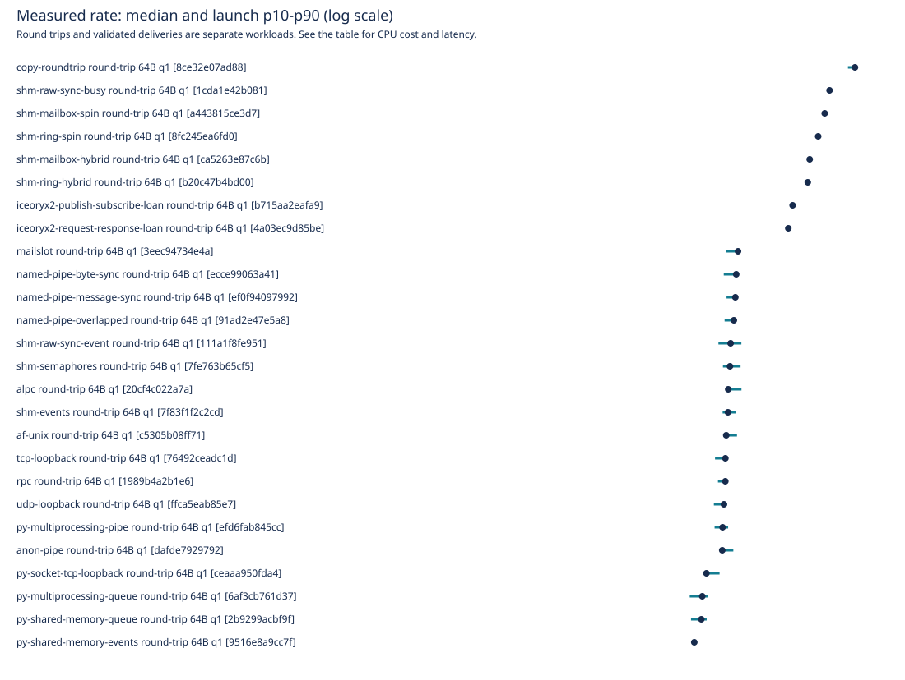

# ipc-bench

Windows 11 IPC benchmark suite inspired by [`goldsborough/ipc-bench`](https://github.com/goldsborough/ipc-bench), rebuilt around a Rust workspace and Windows-native IPC primitives.

The implementation now uses validated frames, bounded process supervision, schema 2 measurements, isolated optimization features, and streaming/windowed throughput modes. See the [measurement contract and commands](docs/measurement-contract.md) and [implementation verification](docs/implementation-verification.md).

The current results below use schema 2 and the pinned toolchain. [Raw evidence and reproduction details](results/published/windows11-20260904/README.md) accompany every campaign; historical snapshots remain available separately.

## Scope

This suite measures **same-machine, low-level, programmable IPC** on Windows 11. It intentionally excludes GUI- and app-integration-oriented mechanisms such as Clipboard, DDE, OLE/COM automation, and `WM_COPYDATA`.

Each benchmark follows the same basic contract:

- parent/child process topology
- validated ping-pong round trips; separately labeled streaming/windowed delivery workloads
- configurable message count, message size, warmups, and trials
- comparable JSON output across Rust and Python methods

## Current benchmark results

All six campaigns were regenerated on **September 4, 2026** from source commit [`794d9fb`](https://github.com/smithtrenton/ipc-bench/commit/794d9fbff310e5b7d2f14d08fc1e847f807213a7): **1,830 successful launches, zero failures**, with five independent launches per configuration. The [complete publication](results/published/windows11-20260904/README.md) includes raw evidence, source and executable hashes, commands, tables and charts.

Host: **Windows 11 Pro build 26200**, **AMD Ryzen 9 7950X3D**, **Rust 1.98.1**, **Python 3.14.7**, **uv 0.12.9**. Parent and worker were pinned to separate physical cores sharing cache (masks 1 and 4, processor group 0). Campaigns ran sequentially; these are local-host observations with ordinary background activity.

| Campaign | Successful launches | Results |
| --- | ---: | --- |
| Round trips: 26 methods × 5 payload sizes | 650 | [Table and spread](results/published/windows11-20260904/round-trip/comparison.md) |
| Individual latency: 3 transports × 2 payload sizes | 30 | [Latency percentiles](results/published/windows11-20260904/latency/comparison.md) |
| Ring streaming/windowed depth sweep | 200 | [Rates, latency and CPU](results/published/windows11-20260904/throughput-rings/comparison.md) |
| IOCP windowed depth sweep | 50 | [Rates, latency and CPU](results/published/windows11-20260904/throughput-iocp/comparison.md) |
| Capacity-eight large payloads, up to 1 MiB | 120 | [Results](results/published/windows11-20260904/capacity-large-payload/comparison.md) |
| Optimization features and build profiles | 780 | [A/B comparisons](results/published/windows11-20260904/experiments/comparisons.json) |

## Round-trip latency

Each cell is the **median launch-average round-trip latency in microseconds**; lower is faster for this workload. Each launch uses three trials, 1,000 warmups, sampled payload validation after a separate full-validation gate, and duration-calibrated operation counts targeting at least 0.1 seconds per trial. Actual minimum durations and launch p10/p90 spread are retained in the [summary](results/published/windows11-20260904/round-trip/summary-v2.json). The target is an estimate, not a guaranteed duration.

| Method | 64 B | 1,024 B | 4,096 B | 16,384 B | 32,704 B |
| --- | ---: | ---: | ---: | ---: | ---: |
| `copy-roundtrip` | 0.027 | 0.054 | 0.173 | 1.523 | 2.429 |
| `af-unix` | 18.219 | 12.531 | 16.505 | 14.699 | 17.124 |
| `alpc` | 16.507 | 10.945 | 17.702 | 25.980 | 34.079 |
| `anon-pipe` | 22.300 | 19.545 | 27.613 | 29.629 | 30.194 |
| `iceoryx2-publish-subscribe-loan` | 0.639 | 0.742 | 1.193 | 2.815 | 5.157 |
| `iceoryx2-request-response-loan` | 0.794 | 0.844 | 1.322 | 2.955 | 5.195 |
| `mailslot` | 10.055 | 17.765 | 19.061 | 13.340 | 23.556 |
| `named-pipe-byte-sync` | 11.015 | 11.644 | 11.906 | 14.347 | 24.168 |
| `named-pipe-message-sync` | 11.514 | 9.928 | 21.818 | 14.127 | 25.156 |
| `named-pipe-overlapped` | 12.416 | 18.682 | 14.698 | 21.400 | 16.275 |
| `py-multiprocessing-pipe` | 21.930 | 52.074 | 33.785 | 45.299 | 41.167 |
| `py-multiprocessing-queue` | 61.117 | 123.389 | 78.987 | 142.006 | 160.447 |
| `py-shared-memory-events` | 91.525 | 92.613 | 95.294 | 97.872 | 64.118 |
| `py-shared-memory-queue` | 64.082 | 112.442 | 107.758 | 63.907 | 120.207 |
| `py-socket-tcp-loopback` | 49.557 | 48.439 | 36.315 | 34.938 | 46.271 |
| `rpc` | 19.095 | 20.062 | 80.548 | 63.021 | 109.724 |
| `shm-events` | 16.703 | 9.760 | 11.313 | 20.210 | 23.157 |
| `shm-mailbox-hybrid` | 0.270 | 0.313 | 0.654 | 2.238 | 5.227 |
| `shm-mailbox-spin` | 0.126 | 0.231 | 0.650 | 2.084 | 4.582 |
| `shm-raw-sync-busy` | 0.099 | 0.173 | 0.645 | 2.263 | 3.998 |
| `shm-raw-sync-event` | 14.611 | 10.701 | 15.870 | 20.462 | 20.522 |
| `shm-ring-hybrid` | 0.297 | 0.370 | 0.677 | 1.991 | 3.529 |
| `shm-ring-spin` | 0.176 | 0.253 | 0.623 | 1.920 | 3.279 |
| `shm-semaphores` | 15.100 | 15.432 | 9.535 | 20.877 | 23.135 |
| `tcp-loopback` | 19.038 | 34.005 | 23.120 | 26.174 | 53.995 |
| `udp-loopback` | 20.517 | 17.835 | 23.606 | 35.264 | 43.812 |

`copy-roundtrip` is a synthetic copy/sequence/validation baseline with no IPC. Busy-spin and sleeping methods have different CPU costs. Reciprocal round-trip latency counts completed request/response pairs per second and does not measure saturated delivery throughput.



## Delivery throughput

The following are **median validated deliveries per second**, measured separately with full validation, 64-byte payloads and ring capacity 64. Trials target one second using retained pilots. Depth 1, 64 and 256 are shown here; [all tested depths and payloads](results/published/windows11-20260904/README.md#validated-delivery-throughput) include launch spread, sampled latency under load and process CPU seconds.

| Method / workload | Depth 1 | Depth 64 | Depth 256 |
| --- | ---: | ---: | ---: |
| `named-pipe-iocp` / windowed | 41,916 | 362,441 | 375,523 |
| `shm-ring-hybrid` / streaming | 3,551,007 | 3,638,660 | 3,603,868 |
| `shm-ring-hybrid` / windowed | 2,604,145 | 2,597,865 | 2,642,432 |
| `shm-ring-spin` / streaming | 6,202,883 | 14,902,771 | 11,339,818 |
| `shm-ring-spin` / windowed | 4,150,435 | 9,054,561 | 8,553,454 |

## Reading the results

- Batch-average spread and launch p10/p90 describe repeated-run variation. Individual-message p50/p95/p99 appear only in the separate latency campaign; throughput percentiles describe its bounded observation-sampling window.
- Core, extension and experimental methods have different semantics. Python rows are runtime baselines, not exact native-transport equivalents. ALPC remains experimental.
- Optimization features remain opt-in. The A/B campaign includes 108 comparisons with overlapping launch ranges; the retained distributions matter more than tiny median differences.
- The [previous schema-2 snapshot](results/published/windows11-schema2/README.md), [initial schema-1 run](results/published/windows11-initial), [high-iteration schema-1 run](results/published/windows11-high-iterations), and [historical analysis](RESULTS.md) retain their original values and toolchains. Their framing, validation and timing differ from the current series, so they are not a controlled before/after performance comparison.

## Implemented benchmark methods

| Tier | Methods |
| --- | --- |
| **Native baseline** | `copy-roundtrip` |
| **Core native** | `anon-pipe`, `named-pipe-byte-sync`, `named-pipe-message-sync`, `named-pipe-overlapped`, `tcp-loopback`, `shm-events`, `shm-semaphores`, `shm-mailbox-spin`, `shm-mailbox-hybrid`, `shm-ring-spin`, `shm-ring-hybrid` |
| **Extensions** | `shm-raw-sync-event`, `shm-raw-sync-busy`, `iceoryx2-request-response-loan`, `iceoryx2-publish-subscribe-loan`, `af-unix`, `udp-loopback`, `mailslot`, `rpc` |
| **Experimental** | `alpc` |
| **Concurrent throughput** | `named-pipe-iocp` (windowed); both `shm-ring-*` methods (streaming and windowed) |
| **Python baselines** | `py-multiprocessing-pipe`, `py-multiprocessing-queue`, `py-socket-tcp-loopback`, `py-shared-memory-events`, `py-shared-memory-queue` |

`copy-roundtrip` is a synthetic copy/sequence/validation baseline. Its guarded frame copies remain observable in release assembly; its timing includes the selected validation policy. Extension and experimental methods are documented separately where semantics or API stability differ.

The published snapshots include the `iceoryx2-*` and `shm-raw-sync-*` extension methods.

The `placeholder` benchmark is a harness smoke target only. It is **not** part of the comparison tables.

## Building

The current toolchain is pinned to Rust **1.98.1** and Python **3.14.7**. Install **uv 0.12.9 or later** and the Visual Studio C++ build tools with a Windows SDK (including MIDL). `Cargo.lock` and `uv.lock` are tracked so builds use the same resolved dependencies.

Install the locked Python development/build tools and configure libclang in the current PowerShell session:

```powershell
uv sync --locked --all-groups
$env:LIBCLANG_PATH = uv run --locked --group build python -c "from pathlib import Path; import clang; print(Path(clang.__file__).resolve().parent / 'native')"
```

Use the release profile for any serious measurement:

```powershell
cargo build --locked --release --workspace
```

The `iceoryx2-*` extension methods require `libclang` during build because upstream `iceoryx2` uses `bindgen` in one of its Windows dependencies. If LLVM is not installed system-wide, set `LIBCLANG_PATH` to a directory containing `libclang.dll` before running Cargo.

For correctness checks:

```powershell
cargo test --locked --workspace
```

Python baselines target **Python 3.14.7** and run through the locked **uv** environment and `.python-version` pin. Python methods implement the same round-trip CLI and JSON contract as the Rust harness.

## Running one benchmark

Native example:

```powershell
cargo run --release -p anon-pipe -- --message-count 1000 --message-size 1024 --warmup-count 100 --trials 3
```

JSON output:

```powershell
cargo run --release -p shm-ring-hybrid -- --format json
```

Copy-only baseline:

```powershell
cargo run --release -p copy-roundtrip -- --format json
```

Python example:

```powershell
uv run --locked python -m benchmarks.methods.python.py_multiprocessing_pipe.run --format json
```

## CLI contract

- `-c`, `--message-count <N>` - number of measured round trips
- `-s`, `--message-size <N>` - payload size in bytes
- `-w`, `--warmup-count <N>` - warmup iterations before timing
- `-t`, `--trials <N>` - number of benchmark trials
- `--format <text|json>` - output format
- `--validation <full|sampled>` - validation policy (default full)
- `--measurement <batch|latency>` - batch averages or individual round-trip samples
- `--timeout-seconds <N>` - whole process-tree deadline (default 120)
- Native throughput methods: `--workload <streaming|windowed>`, `--queue-depth <1..256>`, and `--ring-capacity <power-of-two>`

## Running and regenerating results

To rebuild and rerun all six published campaigns sequentially:

```powershell
uv run --locked --group build python scripts/refresh_benchmarks.py --output target/new-refresh
```

For individual round-trip campaigns, both PowerShell runners build once in release mode and call the shared registry-driven runner. They create a fresh result directory, retain each launch and its diagnostics, and fail if any case fails. Use five launches and explicit placement for comparisons:

```powershell
powershell -ExecutionPolicy Bypass -File scripts/run-benchmarks.ps1 -OutputDir results/round-trip-v2 -StableAffinity -LaunchCount 5
powershell -ExecutionPolicy Bypass -File scripts/run-high-iteration-benchmarks.ps1 -OutputDir results/high-v2 -StableAffinity -LaunchCount 5
uv run --locked python scripts/benchmark_suite.py publish --output results/round-trip-v2
```

The [contract guide](docs/measurement-contract.md#running-and-regenerating) covers full-validation gates, duration calibration, latency distributions, feature A/B campaigns, throughput depth/capacity sweeps, and topology/spin-budget controls. It also defines every metric and its limits.

New series contain `metadata.json`, `source.zip`, source hashes, saved `order.json`, a failure-retaining `manifest.json`, and `cases/*/{report.json,result.json,stdout.txt,stderr.txt}`. `publish` recomputes and validates `summary-v2.json`, `throughput-v2.json`, `comparison.md`, `comparison.svg`, and `saturation.svg` from retained reports. Summaries separate incompatible configuration, executable and affinity groups. CPU cost and sampled latency under load accompany delivery rates.

The original `windows11-initial` and `windows11-high-iterations` directories are preserved. Their existing chart/table generators still read the legacy summaries; new executions must use fresh directories and the schema 2 publisher. Do not overwrite the historical snapshots with current binaries.

## Adding a new method

When adding a benchmark, keep the benchmark contract stable:

1. Add one executable per method under `benchmarks\methods\native\...` or `benchmarks\methods\python\...`.
2. Preserve the shared CLI, warmup behavior, trial behavior, and JSON schema.
3. Keep message semantics aligned with the existing ping-pong contract unless the method must live in the extension or experimental tier.
4. Add the method, payload limit and supported workloads to `benchmarks/methods/registry.json`; runners and CI boundary coverage consume that registry.
5. Document any method-specific caveats clearly, especially if the transport is one-way, framework-heavy, or lower-stability.

## Workspace layout

- `benchmarks\harness` - shared benchmark types, stats, process orchestration, and report formatting
- `benchmarks\methods\native\*` - native Rust benchmark executables and shared native support code
- `benchmarks\methods\python\*` - Python baseline scripts plus the shared adapter module
- `scripts` - benchmark automation scripts
- `results` - captured result sets, including the published Windows 11 result directories

## GitHub Actions

Windows CI checks locked builds, lint/formatting, shared statistics fixtures, every registered payload boundary, fault cleanup, ring backpressure/wraparound, IOCP depth, and forced hybrid wake races. It checks both control and optimization-feature builds and retains correctness artifacts. Performance measurements run on a local Windows host; CI does not establish rankings.
