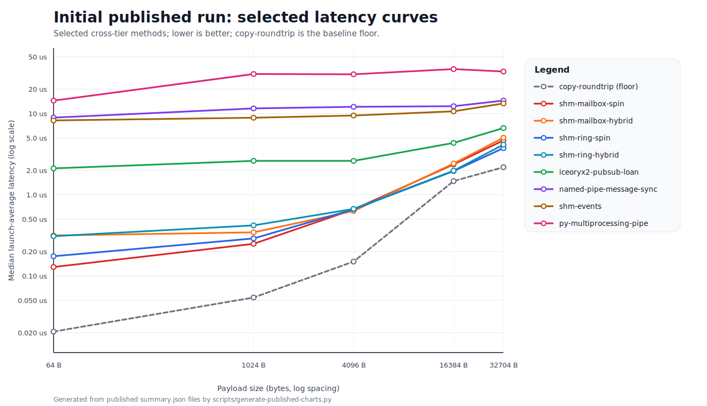
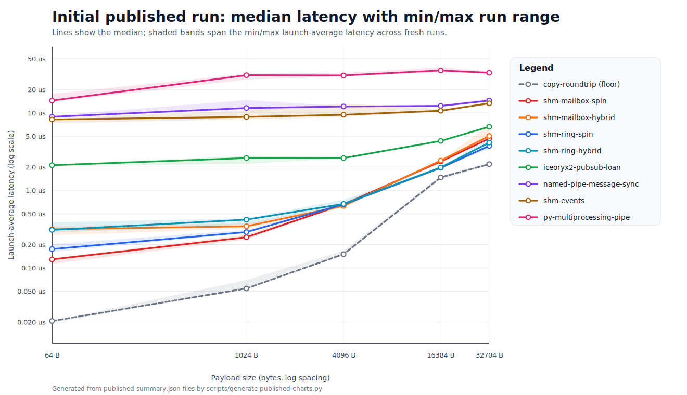
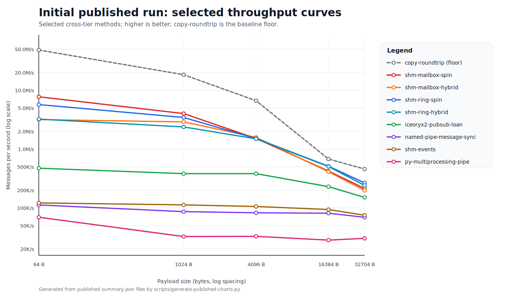
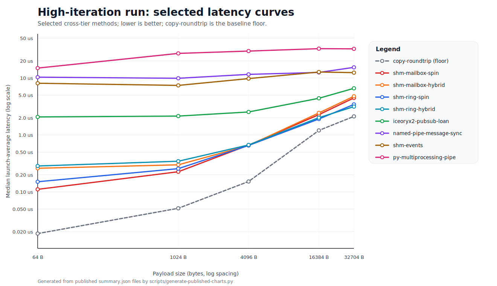

# Published Results Analysis

This document analyzes the published benchmark snapshots in:

- `results\published\windows11-initial`
- `results\published\windows11-high-iterations`

Both snapshots use fixed parent/child CPU affinity and aggregate fresh benchmark launches. The published headline latency metric is `summary.average_micros`, which represents the median launch-average latency for each method and message size.

## Published result sets

| Result set | Purpose | Methodology |
| --- | --- | --- |
| **Initial published run** | Baseline full-matrix comparison across all published methods | `1000` measured messages, `100` warmups, `3` in-process trials, `5` fresh launches, fixed parent/child CPU affinity, median launch-average latency plus p10/p90 spread |
| **High-iteration run** | Lower-noise rerun for the same full matrix | `100000` measured messages, `10000` warmups, `7` in-process trials by default, `mailslot` override of `5000` / `200` / `5`, `5` fresh launches, fixed parent/child CPU affinity, median launch-average latency plus p10/p90 spread |

## Headline observations

- The native latency frontier is still dominated by the shared-memory spin variants. `shm-mailbox-spin`, `shm-ring-spin`, `shm-mailbox-hybrid`, and `shm-ring-hybrid` stay closest to the `copy-roundtrip` floor across both published snapshots.
- The high-iteration rerun sharpens the split between small-message leaders and large-message leaders. Mailbox spin remains the fastest practical IPC result at the small end, while the ring variants become the clear leaders once payload size dominates synchronization cost.
- The `iceoryx2` loan-based methods occupy a strong middle tier: they are materially slower than the hand-tuned shared-memory spin paths, but still much faster than named pipes, sockets, RPC, and the Python baselines.
- Kernel-mediated synchronization methods such as `shm-events`, `shm-semaphores`, and the named-pipe variants cluster in the single-digit to low-double-digit microsecond range for small and mid-sized payloads.
- `shm-raw-sync-busy` remains a special case: it is extremely fast for small messages, but it never rejoins the ring and mailbox leaders at large payload sizes.
- Python methods remain useful as runtime baselines, not transport leaders. Even the fastest Python result trails the fastest native transports by a wide margin.

## Charts

These SVG charts use the same published `summary.json` files as the tables, but they focus on a selected cross-tier subset so the plots stay legible: `copy-roundtrip`, the mailbox and ring leaders, `iceoryx2-publish-subscribe-loan`, `named-pipe-message-sync`, `shm-events`, and `py-multiprocessing-pipe`. The new range charts show the median line plus the min/max launch-average band across fresh runs.

### Initial published run

### High-iteration run

## Baseline full-matrix results

Each cell shows median launch-average latency in microseconds on the first line and messages/sec on the second line from `results\published\windows11-initial\summary.json`. The `Highlight` column marks the fastest practical IPC row for each payload size in this table; `copy-roundtrip` remains the copy-only floor.

| Highlight | Tier | Method | 64 B | 1024 B | 4096 B | 16384 B | 32704 B |
| --- | --- | --- | ---: | ---: | ---: | ---: | ---: |
| **Baseline floor** | Native baseline | `copy-roundtrip` | 0.021 us 48.5M/s | 0.054 us 18.5M/s | 0.150 us 6.7M/s | 1.472 us 679.3K/s | 2.179 us 458.9K/s |
| — | Core native | `anon-pipe` | 21.058 us 47.5K/s | 16.351 us 61.2K/s | 18.064 us 55.4K/s | 26.352 us 37.9K/s | 30.885 us 32.4K/s |
| — | Core native | `named-pipe-byte-sync` | 8.886 us 112.5K/s | 11.712 us 85.4K/s | 12.318 us 81.2K/s | 12.196 us 82.0K/s | 14.456 us 69.2K/s |
| — | Core native | `named-pipe-message-sync` | 8.899 us 112.4K/s | 11.556 us 86.5K/s | 12.091 us 82.7K/s | 12.300 us 81.3K/s | 14.426 us 69.3K/s |
| — | Core native | `named-pipe-overlapped` | 9.853 us 101.5K/s | 12.287 us 81.4K/s | 12.394 us 80.7K/s | 13.177 us 75.9K/s | 15.841 us 63.1K/s |
| — | Core native | `tcp-loopback` | 18.330 us 54.6K/s | 27.826 us 35.9K/s | 21.602 us 46.3K/s | 24.308 us 41.1K/s | 28.501 us 35.1K/s |
| — | Core native | `shm-events` | 8.220 us 121.7K/s | 8.872 us 112.7K/s | 9.445 us 105.9K/s | 10.644 us 93.9K/s | 13.298 us 75.2K/s |
| — | Core native | `shm-semaphores` | 7.706 us 129.8K/s | 8.576 us 116.6K/s | 8.763 us 114.1K/s | 10.824 us 92.4K/s | 13.466 us 74.3K/s |
| **Leader: 64 B** | Core native | `shm-mailbox-spin` | 0.129 us 7.8M/s | 0.249 us 4.0M/s | 0.659 us 1.5M/s | 2.361 us 423.6K/s | 4.671 us 214.1K/s |
| **Leader: 4096 B** | Core native | `shm-mailbox-hybrid` | 0.315 us 3.2M/s | 0.344 us 2.9M/s | 0.630 us 1.6M/s | 2.423 us 412.6K/s | 5.036 us 198.6K/s |
| **Leader: 16384 B, 32704 B** | Core native | `shm-ring-spin` | 0.175 us 5.7M/s | 0.290 us 3.5M/s | 0.660 us 1.5M/s | 1.954 us 511.9K/s | 3.750 us 266.7K/s |
| — | Core native | `shm-ring-hybrid` | 0.309 us 3.2M/s | 0.419 us 2.4M/s | 0.669 us 1.5M/s | 1.976 us 506.0K/s | 4.140 us 241.5K/s |
| — | Extensions | `shm-raw-sync-event` | 8.156 us 122.6K/s | 9.823 us 101.8K/s | 12.915 us 77.4K/s | 10.332 us 96.8K/s | 18.394 us 54.4K/s |
| **Leader: 1024 B** | Extensions | `shm-raw-sync-busy` | 0.153 us 6.5M/s | 0.248 us 4.0M/s | 0.673 us 1.5M/s | 2.232 us 448.1K/s | 9.768 us 102.4K/s |
| — | Extensions | `iceoryx2-request-response-loan` | 2.308 us 433.3K/s | 2.472 us 404.6K/s | 2.775 us 360.4K/s | 4.524 us 221.0K/s | 6.746 us 148.2K/s |
| — | Extensions | `iceoryx2-publish-subscribe-loan` | 2.112 us 473.6K/s | 2.611 us 383.0K/s | 2.610 us 383.1K/s | 4.345 us 230.1K/s | 6.622 us 151.0K/s |
| — | Extensions | `af-unix` | 9.962 us 100.4K/s | 21.382 us 46.8K/s | 12.085 us 82.7K/s | 13.040 us 76.7K/s | 15.402 us 64.9K/s |
| — | Extensions | `udp-loopback` | 18.009 us 55.5K/s | 34.543 us 28.9K/s | 18.777 us 53.3K/s | 20.733 us 48.2K/s | 22.723 us 44.0K/s |
| — | Extensions | `mailslot` | 9.180 us 108.9K/s | 13.483 us 74.2K/s | 9.724 us 102.8K/s | 11.789 us 84.8K/s | 12.979 us 77.0K/s |
| — | Extensions | `rpc` | 17.364 us 57.6K/s | 21.113 us 47.4K/s | 43.606 us 22.9K/s | 53.942 us 18.5K/s | 65.949 us 15.2K/s |
| — | Experimental | `alpc` | 9.010 us 111.0K/s | 10.232 us 97.7K/s | 11.664 us 85.7K/s | 14.235 us 70.3K/s | 19.258 us 51.9K/s |
| — | Python baselines | `py-multiprocessing-pipe` | 14.413 us 69.4K/s | 30.641 us 32.6K/s | 30.412 us 32.9K/s | 35.246 us 28.4K/s | 32.895 us 30.4K/s |
| — | Python baselines | `py-multiprocessing-queue` | 37.012 us 27.0K/s | 63.451 us 15.8K/s | 60.777 us 16.5K/s | 72.740 us 13.7K/s | 70.670 us 14.2K/s |
| — | Python baselines | `py-socket-tcp-loopback` | 19.974 us 50.1K/s | 26.812 us 37.3K/s | 23.505 us 42.5K/s | 30.558 us 32.7K/s | 29.491 us 33.9K/s |
| — | Python baselines | `py-shared-memory-events` | 43.714 us 22.9K/s | 52.711 us 19.0K/s | 51.111 us 19.6K/s | 45.186 us 22.1K/s | 50.033 us 20.0K/s |
| — | Python baselines | `py-shared-memory-queue` | 35.872 us 27.9K/s | 43.839 us 22.8K/s | 40.671 us 24.6K/s | 38.115 us 26.2K/s | 41.869 us 23.9K/s |

The baseline run already shows the major tiers clearly. The `copy-roundtrip` baseline establishes the byte-movement floor; the shared-memory spin variants sit closest to that floor; `iceoryx2` provides a much more framework-heavy but still strong result; the event, semaphore, and named-pipe families form a stable mid-latency group; and RPC plus the Python methods live in a much slower overhead class.

## High-iteration full-matrix results

Each cell shows median launch-average latency in microseconds on the first line and messages/sec on the second line from `results\published\windows11-high-iterations\summary.json`. The `Highlight` column marks the fastest practical IPC row for each payload size in this table; `copy-roundtrip` remains the copy-only floor.

| Highlight | Tier | Method | 64 B | 1024 B | 4096 B | 16384 B | 32704 B |
| --- | --- | --- | ---: | ---: | ---: | ---: | ---: |
| **Baseline floor** | Native baseline | `copy-roundtrip` | 0.019 us 53.9M/s | 0.052 us 19.4M/s | 0.152 us 6.6M/s | 1.200 us 833.2K/s | 2.117 us 472.4K/s |
| — | Core native | `anon-pipe` | 13.804 us 72.4K/s | 16.719 us 59.8K/s | 18.626 us 53.7K/s | 19.187 us 52.1K/s | 22.455 us 44.5K/s |
| — | Core native | `named-pipe-byte-sync` | 10.318 us 96.9K/s | 9.324 us 107.3K/s | 10.235 us 97.7K/s | 11.325 us 88.3K/s | 15.488 us 64.6K/s |
| — | Core native | `named-pipe-message-sync` | 10.333 us 96.8K/s | 9.878 us 101.2K/s | 11.573 us 86.4K/s | 12.516 us 79.9K/s | 15.359 us 65.1K/s |
| — | Core native | `named-pipe-overlapped` | 10.161 us 98.4K/s | 9.464 us 105.7K/s | 11.561 us 86.5K/s | 15.271 us 65.5K/s | 16.928 us 59.1K/s |
| — | Core native | `tcp-loopback` | 17.965 us 55.7K/s | 21.078 us 47.4K/s | 20.571 us 48.6K/s | 24.513 us 40.8K/s | 27.189 us 36.8K/s |
| — | Core native | `shm-events` | 8.079 us 123.8K/s | 7.409 us 135.0K/s | 9.758 us 102.5K/s | 12.721 us 78.6K/s | 12.412 us 80.6K/s |
| — | Core native | `shm-semaphores` | 7.937 us 126.0K/s | 9.879 us 101.2K/s | 8.818 us 113.4K/s | 12.739 us 78.5K/s | 12.643 us 79.1K/s |
| **Leader: 64 B, 1024 B** | Core native | `shm-mailbox-spin` | 0.111 us 9.0M/s | 0.226 us 4.4M/s | 0.662 us 1.5M/s | 2.271 us 440.4K/s | 4.464 us 224.0K/s |
| **Leader: 4096 B** | Core native | `shm-mailbox-hybrid` | 0.260 us 3.8M/s | 0.299 us 3.3M/s | 0.651 us 1.5M/s | 2.437 us 410.4K/s | 4.773 us 209.5K/s |
| **Leader: 16384 B** | Core native | `shm-ring-spin` | 0.151 us 6.6M/s | 0.256 us 3.9M/s | 0.654 us 1.5M/s | 1.906 us 524.8K/s | 3.434 us 291.2K/s |
| **Leader: 32704 B** | Core native | `shm-ring-hybrid` | 0.285 us 3.5M/s | 0.346 us 2.9M/s | 0.668 us 1.5M/s | 2.009 us 497.6K/s | 3.144 us 318.1K/s |
| — | Extensions | `shm-raw-sync-event` | 9.373 us 106.7K/s | 8.139 us 122.9K/s | 10.057 us 99.4K/s | 10.630 us 94.1K/s | 17.934 us 55.8K/s |
| — | Extensions | `shm-raw-sync-busy` | 0.141 us 7.1M/s | 0.238 us 4.2M/s | 0.683 us 1.5M/s | 2.242 us 445.9K/s | 9.910 us 100.9K/s |
| — | Extensions | `iceoryx2-request-response-loan` | 2.244 us 445.6K/s | 2.309 us 433.1K/s | 2.735 us 365.6K/s | 4.582 us 218.2K/s | 6.743 us 148.3K/s |
| — | Extensions | `iceoryx2-publish-subscribe-loan` | 2.072 us 482.6K/s | 2.144 us 466.4K/s | 2.532 us 395.0K/s | 4.403 us 227.1K/s | 6.588 us 151.8K/s |
| — | Extensions | `af-unix` | 9.546 us 104.8K/s | 9.796 us 102.1K/s | 10.643 us 94.0K/s | 13.787 us 72.5K/s | 15.572 us 64.2K/s |
| — | Extensions | `udp-loopback` | 18.979 us 52.7K/s | 17.046 us 58.7K/s | 21.416 us 46.7K/s | 20.806 us 48.1K/s | 22.661 us 44.1K/s |
| — | Extensions | `mailslot` | 9.813 us 101.9K/s | 8.557 us 116.9K/s | 9.287 us 107.7K/s | 14.362 us 69.6K/s | 12.815 us 78.0K/s |
| — | Extensions | `rpc` | 18.356 us 54.5K/s | 19.198 us 52.1K/s | 35.856 us 27.9K/s | 53.174 us 18.8K/s | 59.993 us 16.7K/s |
| — | Experimental | `alpc` | 8.854 us 112.9K/s | 10.694 us 93.5K/s | 11.174 us 89.5K/s | 19.695 us 50.8K/s | 20.516 us 48.7K/s |
| — | Python baselines | `py-multiprocessing-pipe` | 14.916 us 67.0K/s | 27.019 us 37.0K/s | 29.680 us 33.7K/s | 32.710 us 30.6K/s | 32.469 us 30.8K/s |
| — | Python baselines | `py-multiprocessing-queue` | 38.717 us 25.8K/s | 58.620 us 17.1K/s | 53.898 us 18.6K/s | 59.961 us 16.7K/s | 68.882 us 14.5K/s |
| — | Python baselines | `py-socket-tcp-loopback` | 20.989 us 47.6K/s | 19.993 us 50.0K/s | 23.205 us 43.1K/s | 31.280 us 32.0K/s | 29.281 us 34.2K/s |
| — | Python baselines | `py-shared-memory-events` | 53.361 us 18.7K/s | 52.145 us 19.2K/s | 42.549 us 23.5K/s | 45.478 us 22.0K/s | 49.057 us 20.4K/s |
| — | Python baselines | `py-shared-memory-queue` | 42.787 us 23.4K/s | 41.544 us 24.1K/s | 35.534 us 28.1K/s | 38.182 us 26.2K/s | 41.363 us 24.2K/s |

The high-iteration rerun reduces a lot of per-launch noise without changing the overall transport hierarchy. The biggest practical takeaway is that the shared-memory spin methods are not just small-message winners: they remain in a different class from the kernel and framework-heavy transports even after long, repeated measurements.

## Stability and spread

Selected spread examples from the high-iteration snapshot show three distinct behaviors:

1. **Very tight leaders.** `shm-ring-spin`, `shm-ring-hybrid`, and `shm-mailbox-spin` stay extremely narrow even at large payloads. At `32704` bytes, `shm-ring-hybrid` lands at `3.144 us` with a `p10/p90` band of `3.108-3.301 us`.
2. **Stable but slower mid-tier methods.** `shm-events`, `shm-semaphores`, and the named-pipe variants are usually far slower than the spin leaders, but their medians and spreads are still easy to interpret.
3. **Methods with meaningful tail behavior.** `iceoryx2-publish-subscribe-loan` and `iceoryx2-request-response-loan` show visible high-payload tail spread in the high-iteration rerun, and `shm-raw-sync-busy` remains much slower than the ring/mailbox family once the payload gets large.

| Method | Size | Median avg (us) | P10 (us) | P90 (us) | Launch stddev (us) | Takeaway |
| --- | ---: | ---: | ---: | ---: | ---: | --- |
| `shm-ring-hybrid` | 32704 | 3.144 | 3.108 | 3.301 | 0.113 | Large-payload leader with tight launch-to-launch behavior |
| `shm-ring-spin` | 32704 | 3.434 | 3.301 | 3.473 | 0.096 | Also very stable; slightly slower than ring-hybrid at the largest payload |
| `shm-mailbox-spin` | 32704 | 4.464 | 4.414 | 4.635 | 0.100 | Strong and tight, but no longer the large-payload leader |
| `shm-raw-sync-busy` | 32704 | 9.910 | 9.860 | 10.419 | 0.267 | Stabilized by the new methodology, but still far behind the ring/mailbox peers |
| `iceoryx2-publish-subscribe-loan` | 32704 | 6.588 | 6.534 | 10.754 | 2.752 | Good median, but one of the clearest large-payload tail cases |
| `iceoryx2-request-response-loan` | 32704 | 6.743 | 6.691 | 8.859 | 1.409 | Similar story to publish/subscribe, but with a smaller tail |
| `shm-events` | 1024 | 7.409 | 7.392 | 10.202 | 1.421 | Event-based shared memory is still usable, but it shows more launch spread than the spin family |
| `alpc` | 64 | 8.854 | 8.808 | 10.808 | 1.056 | Interesting small-message result, but still noisier than the strongest core methods |

## Method-by-method notes

| Method | Tier | Notes |
| --- | --- | --- |
| `copy-roundtrip` | Native baseline | The byte-movement floor. It is intentionally not IPC and exists to show how close the fastest shared-memory paths get to the pure copy cost. |
| `anon-pipe` | Core native | A straightforward kernel pipe baseline. It is materially slower than the best shared-memory methods and usually not better than the stronger named-pipe variants. |
| `named-pipe-byte-sync` | Core native | One of the stronger kernel-managed transports in the matrix. It stays in the same general tier as message-mode named pipes and usually beats loopback sockets. |
| `named-pipe-message-sync` | Core native | The cleanest named-pipe result in the suite. It is usually very close to or slightly better than byte-mode sync for this ping-pong benchmark shape. |
| `named-pipe-overlapped` | Core native | Overlapped I/O does not buy much in this strictly serialized round-trip pattern. It remains competitive, but it does not displace the simpler named-pipe variants. |
| `tcp-loopback` | Core native | Pays the local network-stack tax. Useful as a familiar socket baseline, but not a latency leader for same-machine RPC-style traffic. |
| `shm-events` | Core native | A stable event-driven shared-memory result. Much slower than the pure spin variants, but a solid middle-tier option with clear semantics. |
| `shm-semaphores` | Core native | Very close to `shm-events`, often slightly better at small sizes. Another stable kernel-synchronized shared-memory reference point. |
| `shm-mailbox-spin` | Core native | One of the absolute latency leaders for small messages. It stays very close to the copy floor when synchronization cost dominates payload cost. |
| `shm-mailbox-hybrid` | Core native | Slightly slower than mailbox spin at the small end, but still extremely strong. It tracks the same family of results with a different synchronization tradeoff. |
| `shm-ring-spin` | Core native | One of the strongest large-payload native results in the suite. The ring family tends to overtake mailbox spin as copy cost grows. |
| `shm-ring-hybrid` | Core native | Close to ring spin and still firmly in the top tier. In the high-iteration snapshot it even edges ring spin at `32704` bytes. |
| `shm-raw-sync-event` | Extensions | External-crate event-based shared memory. It is useful as a reference implementation, but it does not match the hand-tuned native shared-memory leaders. |
| `shm-raw-sync-busy` | Extensions | Extremely fast at small sizes, but at large payloads it settles into a clearly slower band than the ring and mailbox peers. The newer stable methodology tightens its spread, yet it still does not rejoin the top shared-memory group. |
| `iceoryx2-request-response-loan` | Extensions | A strong middle-tier framework result. It is much slower than the custom spin-based shared-memory paths, but dramatically faster than the heavy framework and Python baselines. |
| `iceoryx2-publish-subscribe-loan` | Extensions | Similar to the request/response variant and often slightly faster. It stays in a very attractive middle tier for a production-oriented shared-memory framework. |
| `af-unix` | Extensions | A useful portability-oriented extension, but not a front-runner on Windows against the dedicated Windows-native shared-memory and pipe methods. |
| `udp-loopback` | Extensions | Consistent but still bound to the local network stack. It does not offer a local latency advantage over the better Windows IPC primitives. |
| `mailslot` | Extensions | An interesting Windows-only extension that remains respectable for this harness shape, but it is not a primary choice for low-latency request/response work. |
| `rpc` | Extensions | The most framework-heavy native result in the matrix. Small messages are acceptable, but payload growth drives latency up quickly. |
| `alpc` | Experimental | Promising at the small end and clearly better than the heaviest transports, but still marked experimental because of the lower-level Native API surface and implementation risk. |
| `py-multiprocessing-pipe` | Python baselines | The fastest Python baseline and the best reference point for interpreter + multiprocessing overhead. |
| `py-multiprocessing-queue` | Python baselines | One of the slowest Python paths. Queue serialization and coordination overhead dominate the latency profile. |
| `py-socket-tcp-loopback` | Python baselines | A respectable Python network baseline, but still well behind the native pipe and shared-memory options. |
| `py-shared-memory-events` | Python baselines | Demonstrates that shared memory alone does not erase Python runtime cost. Interpreter and process coordination still dominate the result. |
| `py-shared-memory-queue` | Python baselines | Usually better than the pure Python queue baseline, but still far from the native shared-memory transports. |
