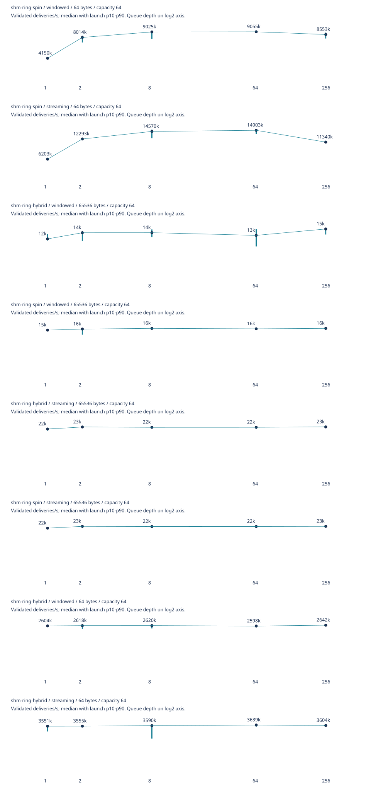
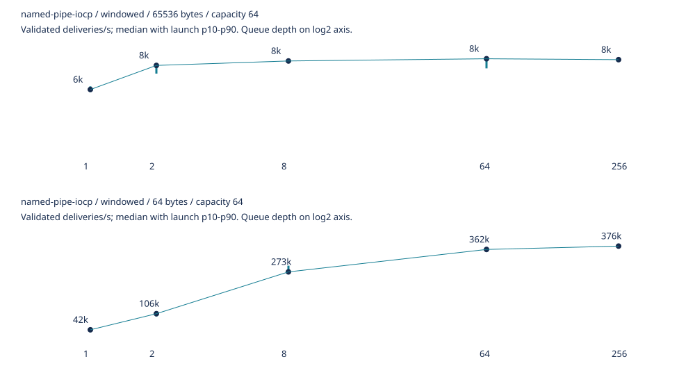

# Windows 11 benchmark refresh — September 4, 2026

All six campaigns were rerun from source commit [`794d9fb`](https://github.com/smithtrenton/ipc-bench/commit/794d9fbff310e5b7d2f14d08fc1e847f807213a7). Each campaign retains source hashes, a source archive, executable hashes, commands, launch order, calibration gates, raw measurements and generated tables/charts.

Windows 11 build 26200; AMD Ryzen 9 7950X3D; Rust 1.98.1; Python 3.14.7; uv 0.12.9. Controlled parent/child masks are 1 and 4 in processor group 0. Launches ran sequentially on this local host; ordinary background activity was not eliminated.

## Campaigns

| Campaign | Launches | Groups | Results |
| --- | ---: | ---: | --- |
| round-trip | 650 | 130 | [Table](round-trip/comparison.md), [summary](round-trip/summary-v2.json), [raw](round-trip/raw.zip), [metadata](round-trip/metadata.json) |
| latency | 30 | 6 | [Table](latency/comparison.md), [summary](latency/summary-v2.json), [raw](latency/raw.zip), [metadata](latency/metadata.json) |
| throughput-rings | 200 | 40 | [Table](throughput-rings/comparison.md), [summary](throughput-rings/summary-v2.json), [raw](throughput-rings/raw.zip), [metadata](throughput-rings/metadata.json) |
| throughput-iocp | 50 | 10 | [Table](throughput-iocp/comparison.md), [summary](throughput-iocp/summary-v2.json), [raw](throughput-iocp/raw.zip), [metadata](throughput-iocp/metadata.json) |
| capacity-large-payload | 120 | 24 | [Table](capacity-large-payload/comparison.md), [summary](capacity-large-payload/summary-v2.json), [raw](capacity-large-payload/raw.zip), [metadata](capacity-large-payload/metadata.json) |
| experiments | 780 | 156 | [Table](experiments/comparison.md), [summary](experiments/summary-v2.json), [raw](experiments/raw.zip), [metadata](experiments/metadata.json) |

All 1,830 measured launches passed. Every group contains five launches. The round-trip campaign now covers all five README payload sizes across 26 methods. Individual-latency measurements cover the same three representative transports and two sizes as the previous publication. Ring and IOCP depth sweeps and all five feature comparisons plus thin LTO, fat LTO and native-target builds were rerun.

## Validated delivery throughput

Median validated deliveries/s for 64-byte payloads at ring capacity 64. Windowed work counts completed responses; streaming counts validated request delivery. These rates are measured separately from round-trip latency.

| Method / workload | Depth 1 | Depth 64 | Depth 256 |
| --- | ---: | ---: | ---: |
| `named-pipe-iocp` / windowed | 41,916 | 362,441 | 375,523 |
| `shm-ring-hybrid` / streaming | 3,551,007 | 3,638,660 | 3,603,868 |
| `shm-ring-hybrid` / windowed | 2,604,145 | 2,597,865 | 2,642,432 |
| `shm-ring-spin` / streaming | 6,202,883 | 14,902,771 | 11,339,818 |
| `shm-ring-spin` / windowed | 4,150,435 | 9,054,561 | 8,553,454 |





## Measurement limits

- Round-trip trials use sampled validation after separate full-validation gates, 1,000 warmups, three trials and a 0.1-second calibration target. The target is an estimate; actual minimum durations and timer fractions are in the summaries. Launch p10/p90 is run-to-run spread, not per-message tail latency.
- Individual-latency trials retain 10,000 samples per launch with full validation. The throughput campaigns use full validation and retain bounded every-16th-sequence observation samples. Main throughput trials target one second; capacity-eight large-payload trials target half a second.
- CPU seconds cover process lifetime, including startup and warmup. The synthetic copy/sequence/validation baseline is not an IPC transport or a universal copy floor.
- Of 132 exploratory optimization comparisons, 108 have overlapping launch ranges, 20 are faster with disjoint ranges, and 4 are slower with disjoint ranges. Features remain opt-in; short local trials do not establish universal improvements.

## Verification and reproduction

The source commit passed [GitHub CI](https://github.com/smithtrenton/ipc-bench/actions/runs/33934041975). Local checks passed all 392 boundaries, 189 fault/stress cases, 85 forced-yield cases and 20 affinity cases, alongside Rust and Python tests, lint and formatting. See [verification.json](verification.json) and [correctness.zip](correctness.zip).

Run the complete campaign from an x64 Windows environment with the pinned tools:

```powershell
uv sync --locked --all-groups
uv run --locked --group build python scripts/refresh_benchmarks.py --output target/new-refresh
```

[commands.json](commands.json) records the exact commands used here. Package any raw campaign with `scripts/package_results.py <raw-directory> <new-published-directory>`. Extract each `raw.zip` into a copy of its campaign directory and run `scripts/benchmark_suite.py publish --output <directory>` to regenerate the numerical tables and SVGs. All six packages were regenerated and compared byte-for-byte. Packages distribute evidence and source, not executables.

The [previous schema-2 publication](../windows11-schema2/README.md) and original schema-1 directories remain historical snapshots.
