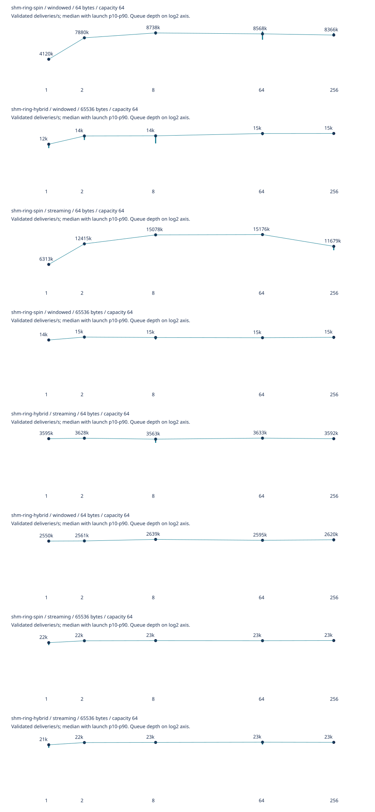
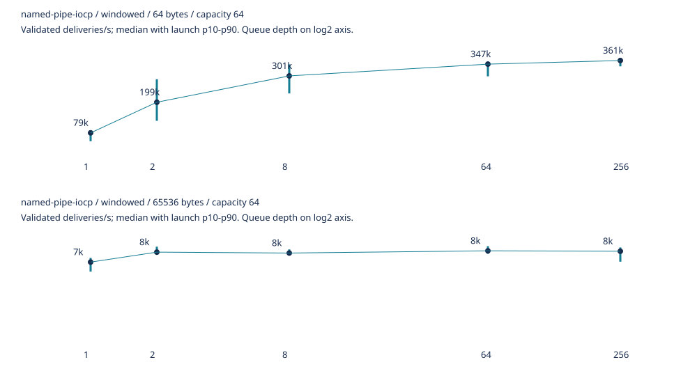

# Windows 11 schema 2 evidence

Separate result series for the corrected implementation. Historical schema 1 snapshots are unchanged.

Windows 11 build 26200; AMD Ryzen 9 7950X3D; Rust 1.98.1; Python 3.14.7. Effective parent/child masks were 1 and 4 in processor group 0. Full per-series metadata, source provenance and binary hashes are retained. These local-host observations do not establish a universal transport winner.

| Series | Successful launches | Groups | Evidence |
| --- | ---: | ---: | --- |
| experiments | 780 | 156 | [Table](experiments/comparison.md), [summary](experiments/summary-v2.json), [raw](experiments/raw.zip), [metadata](experiments/metadata.json) |
| round-trip | 390 | 78 | [Table](round-trip/comparison.md), [summary](round-trip/summary-v2.json), [raw](round-trip/raw.zip), [metadata](round-trip/metadata.json) |
| latency | 30 | 6 | [Table](latency/comparison.md), [summary](latency/summary-v2.json), [raw](latency/raw.zip), [metadata](latency/metadata.json) |
| throughput-rings | 200 | 40 | [Table](throughput-rings/comparison.md), [summary](throughput-rings/summary-v2.json), [raw](throughput-rings/raw.zip), [metadata](throughput-rings/metadata.json) |
| throughput-iocp | 50 | 10 | [Table](throughput-iocp/comparison.md), [summary](throughput-iocp/summary-v2.json), [raw](throughput-iocp/raw.zip), [metadata](throughput-iocp/metadata.json) |
| capacity-large-payload | 120 | 24 | [Table](capacity-large-payload/comparison.md), [summary](capacity-large-payload/summary-v2.json), [raw](capacity-large-payload/raw.zip), [metadata](capacity-large-payload/metadata.json) |

The 1,570 measured launches all passed. Each comparison group has five independent launches. Correctness and calibration gates are separate from measured launches. The A/B campaign has 156 full-validation gates and 132 comparisons; 101 launch ranges overlap, 28 are disjoint and faster, and three disjoint and slower. All optimization features remain opt-in. See [A/B comparisons](experiments/comparisons.json) for all launch averages.

## Observed depth curves

Full validation; capacity 64; 64-byte payload. Rates count validated deliveries. These points illustrate the observed flattening/decline at high depths, with timing and CPU tradeoffs retained in the linked tables. They are not reciprocal RTT or an absolute transport maximum.

| Method / workload | Depth 1 deliveries/s | Depth 64 deliveries/s | Depth 256 deliveries/s |
| --- | ---: | ---: | ---: |
| shm-ring-hybrid / streaming | 3,594,796 | 3,633,163 | 3,592,446 |
| shm-ring-hybrid / windowed | 2,550,246 | 2,594,663 | 2,619,779 |
| shm-ring-spin / streaming | 6,313,185 | 15,175,762 | 11,679,302 |
| shm-ring-spin / windowed | 4,119,711 | 8,568,070 | 8,366,313 |
| named-pipe-iocp / windowed | 79,223 | 346,991 | 361,086 |

## Interpretation and reproduction

- Round-trip means and launch spread are separate from individual-latency percentiles. The latency series retains 10,000 individual samples per launch; throughput retains the documented bounded every-16th-sequence observation samples.
- Main throughput trials target one second with retained duration pilots; actual durations vary and are reported. The capacity-eight campaign extends payloads to 1 MiB. CPU seconds include process startup, warmup and shutdown.
- The final IOCP series includes monotonic sequences across phases. Earlier IOCP throughput measurements are excluded from the ring publication and superseded by `throughput-iocp`.
- Extract a campaign's `raw.zip` into a copy of that campaign directory, then run `uv run --locked python scripts/benchmark_suite.py publish --output <directory>`. All six packaged series were regenerated and their summaries, tables and SVGs compared byte-for-byte.
- Each `package.json` hashes the files and records case selection. Source archives and binary hashes identify dirty-tree revisions; binaries are not distributed. The A/B native archive was reconstructed and verified against the source hashes saved before compilation.
- See [correctness.zip](correctness.zip), [verification.json](verification.json), [assembly audit](assembly/audit.json), and the [implementation verification](../../../docs/implementation-verification.md) for checks and limits. GitHub-hosted CI was configured but not executed in this session.
